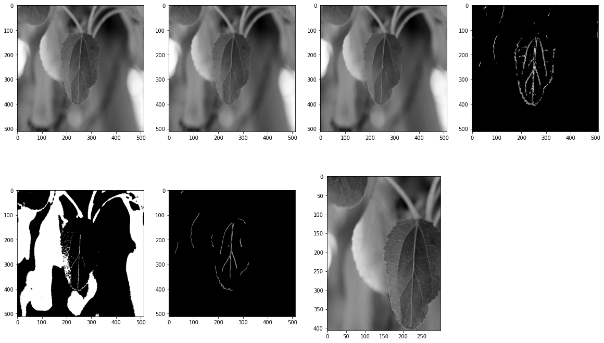
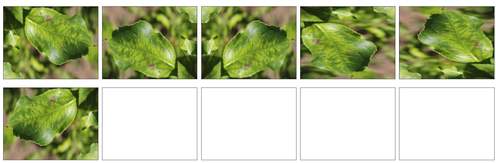
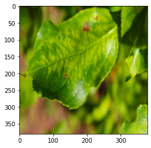

# Kaggle Plant Pathology

    *   Public Leaderboard: 0.978/0.990(#1), 239/1317(Top 18%)
    *   Private Leaderboard: 0.967/0.984(#1), 340/1317(Top 26%)
    
## Image Preprocessing
### 1. Cut Background
#### grabcut

#### Gaussian blur, denoise, threshold, canny

## Image Augmentation
### 1. Rigid Transform

### 2. Saturation

